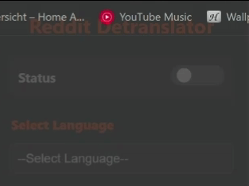

# Reddit-Detranslator

### How to Use

***Status***: Should the Extension remove Reddits translation or not?
***Select Language***: Choose one of the languages, which should be detranslated by the Extension. 

The Extension will **only** work on reddit.com and will **only** remove one of the supported languages: 
- English
- French
- German
- Hindi
- Italian
- Latin American (Spanish)
- Portuguese
- Spanish
